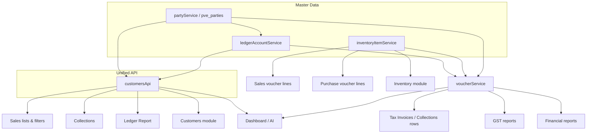

# PVE InvoicePro 360 — Data Integration Map

Single source of truth for **customers/suppliers**: `partyService` (persisted `pve_parties`) + auto-linked `pve_ledger_accounts`.

Public API for UI modules: **`customersApi`** (`desktop/src/services/customers/customersApi.ts`).

Sync event: **`pve:parties-changed`** — fired when parties are created, updated, deleted, or hydrated from ledgers.

---

## Core storage keys

| Key | Service | Contents |
|-----|---------|----------|
| `pve_parties` | `partyService` | Customer/supplier master (Party) |
| `pve_ledger_accounts` | `ledgerAccountService` | Chart of accounts (incl. Sundry Debtors/Creditors) |
| `pve_vouchers` | `voucherService` | Sales, purchase, receipt, payment vouchers |
| `pve_sales_pipeline` | `salesPipelineService` | Quotations, orders, proforma, dispatch |
| `pve_inventory_items` | `inventoryItemService` | Inventory master |
| `pve_party_profiles` | `partyProfileService` | Extended customer profile (CRM fields) |

---

## Module dependency map

---

## Customers ↔ modules

| Module | Data source | Join key | Notes |
|--------|-------------|----------|-------|
| Customers list | `customersApi.list()` | `party.id` | Persists via `partyService` |
| Sales document filters | `customersApi.listCustomerFilterOptions()` | `ledgerId` | Matches voucher party line |
| Tax invoice rows | `salesDocumentService` → `voucherService` | `customerId` = ledger id | Name from ledger map |
| Collections form | `customersApi.list('ALL')` | `party.ledgerId` | Auto `ensureLedgerForParty` |
| Ledger Report | `customersApi.listLedgerCustomerOptions()` | `ledgerId` | Includes invoice-only sundry ledgers |
| Dashboard outstanding | `dashboardAggregator` → vouchers + ledgers | ledger id | |
| Reports (party ledger) | `ledgerReportService` | `ledgerId` | |

---

## Items ↔ modules

| Module | Data source |
|--------|-------------|
| Inventory master | `inventoryItemService` |
| Sales / Purchase vouchers | `inventoryItemService` (line items) |
| Stock adjustments | `inventoryItemService` + voucher stock engine |
| Low stock dashboard | `dashboardAggregator.lowStock()` → inventory |

---

## Sales / Purchase ↔ GST & Reports

| Flow | Source |
|------|--------|
| Sales → GST | `voucherService` (SALES lines with GST amounts) |
| Purchase → GST | `voucherService` (PURCHASE lines) |
| Sales → Reports | `reportService`, `ledgerReportService`, `salesDocumentService` |
| Purchase → Reports | `purchaseDocumentService`, `reportService` |

---

## Banking ↔ Collections

| Flow | Source |
|------|--------|
| Receipt vouchers | `voucherService` type RECEIPT |
| Bank/cash ledgers | `ledgerAccountService` (cash/bank groups) |
| Collection form | `fetchOutstandingInvoices` + receipt voucher create |

---

## Real-time sync

Listen for these events to refresh UI:

| Event | When |
|-------|------|
| `pve:parties-changed` | Customer create/update/delete, ledger hydration |
| `pve:vouchers-changed` | Invoice, receipt, payment saved |
| `inventoryItemsChanged` | Item master changes |

Modules wired to `pve:parties-changed`: Customers list, Sales lists, Purchase lists, Ledger Report, Collections form.

---

## Fix applied (hhhj / missing ledger dropdown)

**Root cause:** Ledger Report only showed parties with `ledgerId` from `customersApi`, while tax invoices reference **sundry debtor ledger accounts** directly. Invoice-only customers (ledger exists, party row missing or no `ledgerId`) were excluded.

**Fix:**
1. Persist parties to `pve_parties` (survive app restart).
2. `customersApi.listPartyFilterOptions()` merges parties + sundry ledgers.
3. `partyService.ensureLedgerForParty()` backfills missing ledgers.
4. All customer dropdowns use `customersApi` instead of raw `ledgerAccountService.list()`.
