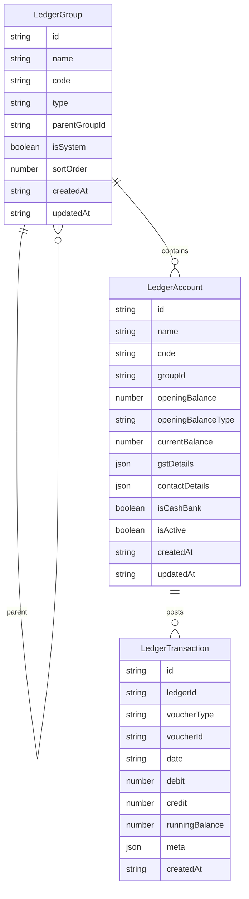
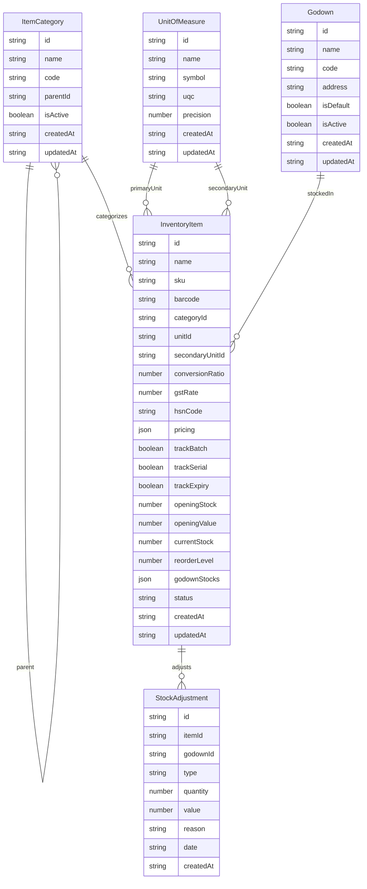

# Phase 3 Masters – ER Diagrams

This document captures the approved baseline schema for Phase 3 (Masters). All services and UI work must stay aligned with these relationships.

## Ledger & Group Model

## Inventory Masters

